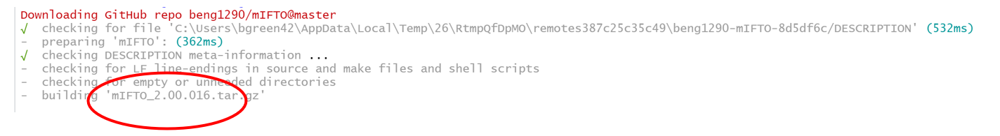
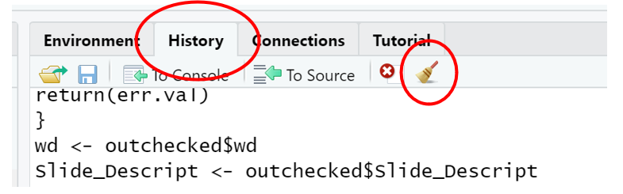
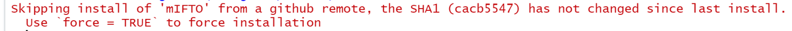
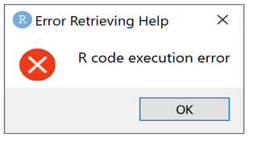
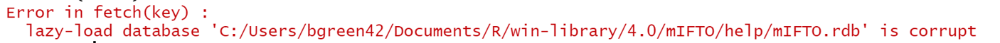
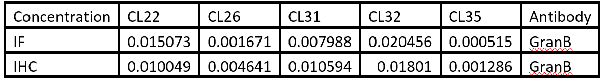
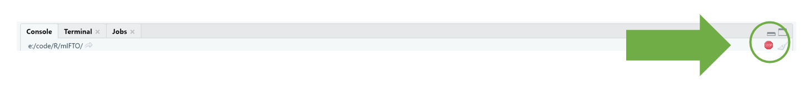

# Multiplex Immunoflouresence Titration Optimization (mIFTO) R Package 
#### <div align="center">***v.2.00.0021***</div>
#### <div align="center">Created by: Benjamin Green & Charles Roberts</div>
#### <div align="center">Based on code orginally written by Dr. Nicolas Giraldo-Castillo</div>
#### <div align="center">Tumor Microenvironment Technology Development Center</div>
#### <div align="center">The Johns Hopkins University Bloomberg~Kimmel Institute for Cancer Immunotherapy</div>
#### <div align="center">Correspondence to: bgreen42@jhu.edu</div>

## ***Section 1: Summary***
This R package was developed to help organize and quantify the inForm Cell Analysis output for pixel-by-pixel, cell-by-bell, and tissue segmentation data. The primary goal of this package is to aid in the assessment and determination of optimum staining conditions for multiplex immunofluorescence titrations on Akoya’s scanning and staining platform. There are two primary functions of ```mIFTO```; ```FOP()``` and ```mIFTOapp()```. ```FOP()``` was designed to measure the ‘fractions of positivity’ for individual conditions. Then, with a unique identifier, the group conditions together into a single csv output file. The function uses the inForm output tables (IF or IHC) for cell segmented, colocalization data, or tissue segmented data as input. The other primary function, ```mIFTOapp()```, was developed to aid in determining an optimum condition for a series of reagent titrations. The output includes pixel histograms of intensity, t-statistics, signal-to-noise ratios, fractions of positivity, and boxplots of expression profiles. 
## ***Section 2: Getting Started***
#### ***Section 2.1: Initial Package Install***
Open an Rstudio session to get started. Next, install the package from github using the following commands:
```
install.packages(‘devtools’)
library(devtools)
install_github('beng1290/mIFTO')
```
When the package begins to install a number of messages will appear in the console indicating the status of different events, especially during the initial install or just after R has been updated, this is normal. Some of the messages may be in red, this does not indicate an error. If there is an error during installation, usually the output message to the console will start with ```“Error:”``` or ```“Warning:”```, then describe the corresponding error. 

The installation of ‘devtools’ is usually the most interactive and takes the longest. This is a provided R package which is used for external programmers to develop R packages. During the ```devtools``` installation command (command 1 above), R may require some user input, examples of this include: 

1.	R may indicate that some packages should be updated. The user can either indicate to update all, some or none of the packages. It is usually best to select the update all option. 
2.	A dialog box may also open asking the user if the package should ‘be compiled from source’, it is usually best to answer ‘yes’ to this 
3.	A dialog box may open telling the user that a package is in use and that the R session must be restarted to continue installation of a package. It is usually best to allow R to do so. Note that is may take a few moments for R to reinitialize after it restarts, this is normal. 

Errors are common in this step, usually when updating packages. If a package fails to update properly and crashes the installation process an error message is usually output beginning with: ```“Error: package ‘failed_package_name’``` failed to install’. Installing the package separately may be necessary. Enter ```install.packages(‘failed_package_name’)```; replacing ‘failed_package_name’ with the name of the failed package.

For more advanced users of R, it may be easier to specific additional options during a package installation. For example, when installing ‘devtools’ the following options can be specified:

```install.packages(‘devtools’, ask = FALSE, quiet = TRUE, verbose = FALSE)```

This command will install ```‘devtools’``` without asking the user if it is okay to updated or compile a package and will carry out the procedures automatically. The command will also significantly reduce the output to the console. 

When the ```install_github('beng1290/mIFTO')``` command is used, R will output the following messages, followed by a number of other messages. 



It advisable to check the circled region above to make sure that the correct version of the package is installed. 
#### ***Section 2.2: Updating the Package***
When an update for the package is available on github, it is advisable that, if the user already had an R session open with an old version running, the user clear their R history, completely close their current R session or window, and open a new session. 

To clear the R history, go to the ‘history’ tab on the top right of the R user interface and select the broom icon, as shown below:



After the new R session is open, the advisable steps for updating the mIFTO R package would be the same as a new install:

```
install.packages(‘devtools’)
library(devtools)
install_github('beng1290/mIFTO')
```

For additional details see section 2.1. If the most up to date package is already installed under the current user profile the following message may appear instead:



If this is a potential mistake it is then possible to use ```install_github('beng1290/mIFTO', force = T)``` in order to force an updated installation of the R package. 

A second installation may corrupt the package, in this case the following message will appear:



Once ‘OK’ is clicked, the following lines will be printed into the console (with a local R library path in place instead of bgreen42):



To fix this error, close the current R sessions completely, open a new session, and reinstall the package.

#### ***Section 2.3: Running Package***

The installation calls and ```devtool``` library call will only be needed the first time the ```mIFTO``` package is used, unless additional updates to the package have been posted (see section 2.2). 

Once installed once for a user profile, the user can run the apps one of two ways: 

1.	load a library into the current ‘workspace’ by using ```library(current_package)``` replacing ```‘current_package’``` for whichever library is needed. To load the ```mIFTO``` R package type: ```library(mIFTO)```. Afterward the call the apps using ```FOP()``` and ```mIFTOapp()```.
2.	Explicitly call the package and the functions simultaneously without loading the package into memory. In this case use the syntax ```package_name::function_name```. For the main apps described in this document use ```mIFTO::FOP()``` and ```mIFTO::mIFTOapp()```.

Code performance is reliant on the local systems connection to the images as well as the computational resources of the local system. Since the image data for these images can be very large, it is advisable that either the images are kept local to the machine the software is run on or that they can be accessed by a high speed network connection. 

## ***Section 3: FOP***
#### ***Section 3.1: Description***

This function is used to measure the fraction of positivity across a subset of images for uniquely named slide. The function is designed to count positivity for cell-by-cell, pixel-by-pixel, or tissue segmented data exported from inForm. 

#### ***Section 3.2: Setting up Slide Names***

When naming slides for this protocol, be sure to name slides using unique slide ids, followed by unique condition ids. An example of an acceptable name would be M1_Multiplex1 (M1 being the slide id and Multiplex the condition id). 

#### ***Section 3.3: Extracting and Exporting Data from inForm***
a.	For **cell-by-cell data**: 
  -	use the phenotype module and export the cell segmented inForm, name the positive phenotype with the same case as the input for ‘Primary Antibody’ in the GUI (see below). 
  
b.	For **pixel-by-pixel**:
  -	use the colocalization module of inForm and export the colocalization data. Do not name the opals in the ‘prepare’ tab of inForm.
  
c.	For **tissue segmentation**:
  -	use the tissue segmented module in inForm and export the tissue segmentation data. Name the categories ‘Tumor’ and ‘Non Tumor’ in inForm.

For all exports, do not name the opals in the ‘prepare’ tab of inForm, the code will not be able to find the correct columns. Note that the code will generate statistics for all slides in the selected folder (see below for more details in step 5).

#### ***Section 3.4: GUI Input and Running***
1. Open R Studio and install the package (see ‘Section 2: Getting Started’ for installation instructions)
2. Type ```mIFTO::FOP()``` & ```ENTER```
3. The app will open in a web browser with the following inputs
   - Slide Identifier:
     - This is where the specimen numbers or other slide distinctions are located
     - Do not add ‘–‘ or spaces in names 
     - Place a comma between names
     - E.g.: Melanoma1,Melanoma2
    - Primary Antibody: 
      - This is the antibody the analysis is running for 
      - E.g.: CD8
    - Other condition delineation: 
      - Anything else in the name that could separate different conditions in excel spreadsheet output
      - E.g.: (V1, IHC, IF, 1to100, 1to200)
      - E.g.: for GranB put IF in the ‘other condition delineation’ field for the IF and IHC in the ‘other condition delineation’ field for the IHC you will would get the following:
        
     - Primary Opal
       - This is the Opal the primary AB is in
       - E.g.: 540
      - Is this IHC?
        - Blank = no
        - Check = yes
      - What kind of positivity measure?
        - Drop down box with the following options
          - PPC pixels
          - Cells
          - Tissue
4. Click ‘Run FOP’
5. A windows explorer will ask you to point it to the directory with the data inside
   - The code will generate statistics for all slides in the selected folder.
6. The program will run for this condition then ask if there is another condition
   - Only say yes if the Slide Descriptors are the exact same
7. Yes:
   - A new GUI will open asking for the new:
     - Primary Antibody
     - Other condition delineation
     - Primary Opal
     - IHC?
   - Click Run
   - A windows explorer will ask you to point it to the directory with the data inside
   - The program will run and ask if there is more data 
8. No:
   - A window explorer will open for the output directory
9. A file called +pixels will be located in the output directory

Once finished running the app will idle in the background and continue to wait for input. To stop the UI click the red ‘stop’ sign button just above the console window in RStudio and close the web browser.



#### ***Section 3.5: Common things to check after running into errors***
1. Not putting conditions into separate folders
2. Misspelling input to charts
3. Not labeling Opals – AB pairs in inform output
4. Leaving out Slide Descriptors for slides in the data folder when writing into input box
5. Typing Slide Descriptor names in wrong
6. Sometimes the folder browsing window opens behind the Rstudio session. 
7. The UI will not respond well to multiple clicks
8. You may need to adjust the browser window sizing on your machine to get everything to line up well
9. In output, if some columns do not average
   - See 4 or 5

## ***Section 4: mIFTOapp***
#### ***Section 4.1: Description***
This function is used to select optimum dilutions from a titration series. For a titration series, at least 3 cases with 10HPFs each should be used. For best results stain at least 5 dilutions, one above and 4 below the manufactures recommended concentration. 
#### ***Section 4.2: Setting up Slides Names***
When scanning, so that the slides are compatible with the code, name the slides with the following naming convention switching out only the bracketed and italic expressions being sure to use underscores between words:

\[*SlideID*\}_\[*PrimaryAntibody*\]_1to\[*CocentrationofPrimaryAntibody*\]_\[*PolymerUsed*\]_Opal\[*OpalUsed*\]_1to\[*OpalConcentrationUsed*\]. 

An example of a properly named slide is *T6_PD1_1to150_PV50_Opal650_1to50*, which would be from slide ‘T6’, stained with ‘PD1’ at ‘1to150’, using a power vision polymer at 50 percent (PV50), in ‘Opal650’ with an opal concentration of ‘1to50’. 

It is important that the slides are named in this way at scanning as slide names are propagated to the image HPFs and the image data. The app looks for specific keys in the names to differentiate between conditions/ slides and to collect the correct data. For example, the app looks for the slide identifier at the beginning of the image name followed by an underscore. In the above example, this allows the code to differentiate between ‘T6’, ‘T60’, ‘T6A’, or ‘T600’. The most important aspect of this is in the dilution series identifiers where one might titrate 1to100 and 1to1000 in the same series, without this naming convention the code might mistake all these slides as 1to100. Additionally, since the slides can have different primary and opal concentrations, it is useful to always designate both as a standard so that the code searches for the concentration that directly follows the primary antibody or opal. 

#### ***Section 4.3: Exctracting and Exporting Data from inForm***
The pixel-by-pixel analysis and cell-by-cell analyses are performed by separate modules in the app as usually one modality or the other is used to determine the optimal dilution. Once the images have been stained and scanned, establish thresholds for pixel-by-pixel data or phenotype the data for cell-by-cell optimum accuracy in the respective modalities. 
For cell-by-cell analysis, export the cell segmented for each HPF.  For pixel-by-pixel analysis export the component data images for each HPF. Dilutions\ conditions can either be exported into separate or a single folder. Be sure to follow naming conventions if the data is in separate folders by dilutions using the above naming convention for the folders. Remove the slide designations as well as the first underscore, e.g. this would be ‘PD1_1to150_PV50_Opal650_1to50’. 
#### ***Section 4.4: GUI Input and Running***
1. Open R Studio and install the package (see ‘Section 2: Getting Started’ for installation instructions)
2. Type mIFTO::mIFTOapp() & ENTER
3. The app will open in a web browser with the following inputs: (Note: it may be necessary to resize the window to allow all fields to line up appropriately) 
   - Slide Identifier:
     - This is where the specimen numbers or other slide distinction are located
    	- Do not add – or spaces in names 
      - Place a comma between names
      - E.g. Melanoma1,Melanoma2
   - Primary Antibody: 
     - This is the antibody the analysis is running for 
     - E.g. CD8
   - Concentration: 
     - Concentrations that have been completed
     - 100,200,400
   - Fluorophore (TSA)
     - This is the wavelength used to detect the Flourophore (TSA) reagent
     - E.g. 540 OR 570
     - The code only supports the use of component tiffs with image layers unmixed from Akoya’s 7 and 9 color libraries using        the following wavelengths:
       - DAPI, 480, 520, 540, 570, 620, 650, 690, 780
   - Was naming convention followed? (Was more than one dilution used in the name …)
     - Check Yes if the files are named using the naming convention described in section 4.2
   - What is being titrated
     - Primary Antibody
     - Fluorophore (TSA)
   - For Cell segmented data – NOT YET FUNCTIONING
   - For Pixel data
     - Is the data in separate folders according to dilution
       - Check = yes
       - Blank = no
     - Was an IHC thresholded with this dilution
       - Check = yes
         - add the connected pixels and threshold values to the end of their respective lists
         - This option also requires that the ‘component tiffs’ are exported from inForm for the IHC images
           - For data separated in folders by dilution, put the IHC data into a folder named ‘IHC’ or ‘AntibodyX_IHC’          replacing ‘AntibodyX’ for the value in the ‘Primary Antibody’ field
       - Blank = no
     - Were thresholds different for each case
       - Check = yes
         - new fields will open for each slide identifier under the ‘connected pixels’ and ‘thresholds’ input locations
       - Blank = no
     - List the thresholds in order of increasing dilution separated by a comma
       - E.g. 12.5,13.6,14.7
       - Must be same length as number of concentrations
     - List the thresholds in order of increasing dilution separated by a comma
       - E.g. 12,13,14
       - Number of pixels above the threshold which must be connected for the values to be included in the positive signal, (setting can be set in inForm colocalization module and should be translated here) 
       - Must be same length as number of concentrations and should be whole numbers
     - Click ‘Run Pixel-by-Pixel’
10. A windows explorer box will be generated to find data folder and a progress bar should open in the bottom right hand corner
    - If data is in separate folders select the parent folder
    - The windows explorer may open behind the Rstudio or web browser window
11.	The program will produce results in a Results.cell or Results.pixels folder for cell or pixel data respectively
12.	There will be a ‘Finished’ Dialog when the software finished
13. If no more conditions need to be run, close the web page to exit and exit the ```mIFTOapp``` in R by click the red stop sign button in the RStudio console.


#### ***Section 4.5: Common things to check after running into errors***
1. For most errors a dialog should open with a clear message of what went wrong. 
2. If an 'undefined error' appears
   - first check that the ```BiocManger``` and ```EBImage``` packages have installed correctly 
   - if they have then the error must be a bug in the code, please report any bugs as quickly as possible so that they can be      resolved
3. If the error causes the UI windows to grey out simply close the web browser window, select the red ‘stop sign’ in the RStudio console
   
   
   
   Then rerun the app using ```‘mIFTO::mIFTOapp()’```

4. Sometimes it may be necessary to resize the window manually to get the UI to line up appropriately.


